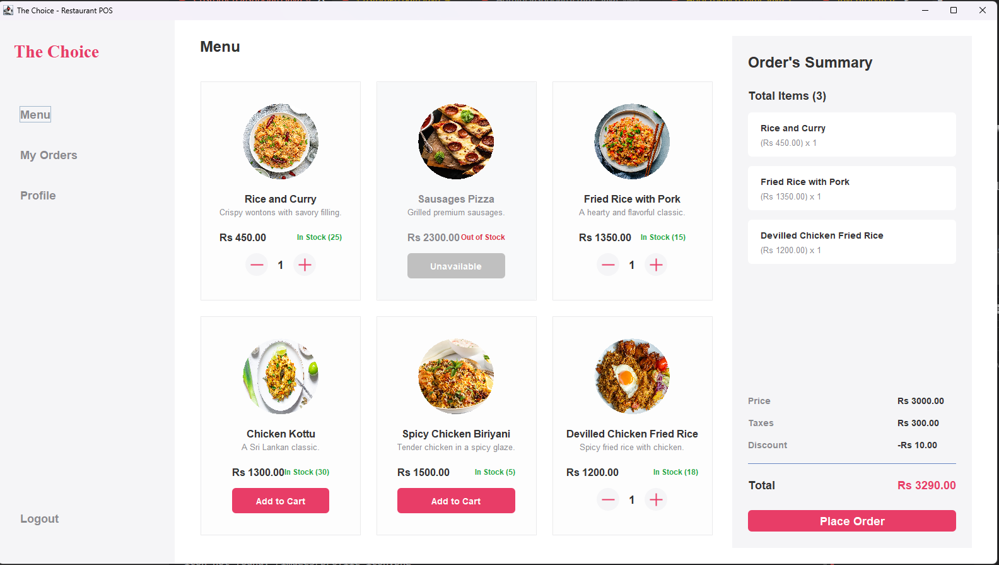
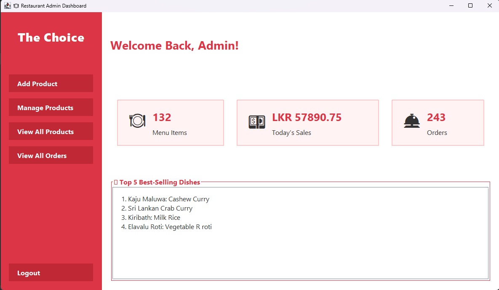
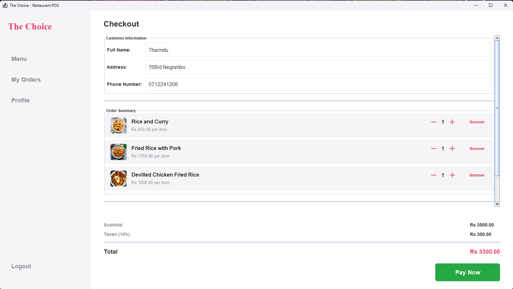
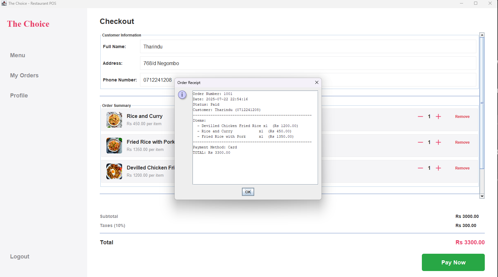

---

# Restaurant POS & Admin Management System

A **Restaurant Point of Sale (POS) and Admin Management System** built in **Java** using the **MVC (Model-View-Controller) architecture**. The system streamlines restaurant operations, allowing admins to manage products, track orders, monitor inventory, and view analytics on a centralized dashboard.

---

## Features

* **Product Management:** Add, update, delete, and search food and beverage items with details like category, price, description, stock, and status.
* **Order Tracking:** Track customer orders in real time, including order status and details.
* **Inventory Control:** Monitor stock levels and receive alerts for low or high inventory.
* **Dashboard Analytics:** Visual statistics on sales, orders, and product performance.
* **Secure Admin Login:** Password encryption for admin authentication.
* **MVC Architecture:** Separation of concerns for better maintainability and scalability.

---

## Screenshots

### Order & Admin Dashboard
<p>
  
  
</p>

### Checkout
<p>
  
  
</p>


---

## Technologies & Tools

* **Programming Language:** Java
* **GUI Framework:** Java Swing
* **Database:** MongoDB
* **Architecture:** MVC (Model-View-Controller)
* **Libraries:** MongoDB Java 

---

## Project Structure

```
restaurant-pos-system/
│
├─ src/
│  ├─ controller/           # Handles logic and database operations
│  ├─ model/                # Data models (Product, Order, Customer)
│  ├─ view/                 # GUI components (Dashboards, Forms, Tables)
│  └─ Main.java             # Entry point of the application
├─ lib/                     # External libraries
├─ screenshots/             # Screenshots of application interfaces
├─ README.md
└─ .gitignore
```

---

## Installation & Setup

1. Clone the repository:

```bash
git clone https://github.com/<your-username>/restaurant-pos-system.git
cd restaurant-pos-system
```

2. Open the project in **Eclipse** or **IntelliJ IDEA**.

3. Add **MongoDB Java Driver** to your project libraries if not already included.

4. Configure the database connection in `DatabaseConfig.java` (or your config file) to match your MongoDB setup.

5. Run `Main.java` to start the application.


---

## Future Improvements

* Integrate **POS hardware** like receipt printers and barcode scanners.
* Add **multi-user roles** (managers).

---
